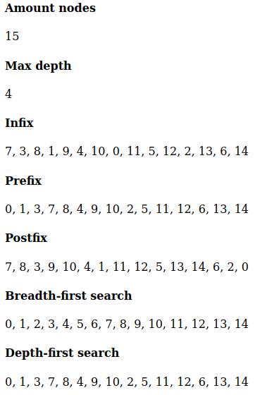

## Binary tree visualization

Creates a binary tree out of a given number and plots it on a JS canvas object. 

An infix stepper button guides you through the tree on each click.

Different traversals and characteristics are also shown.

## Picture

