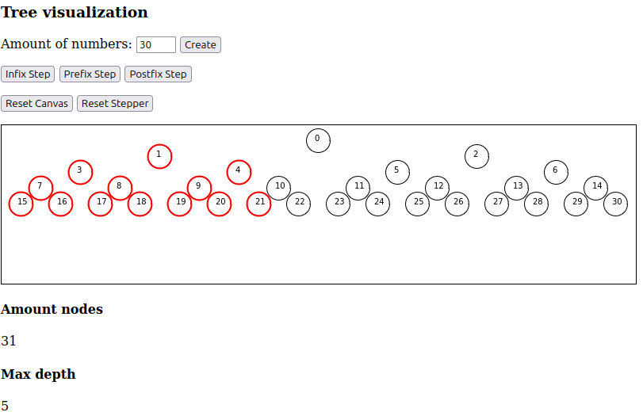

## Binary tree visualization

Creates a binary tree out of a given number and plots it on a JS canvas object. 

Different traversals stepper buttons guiding you through the tree on each click.

## Picture

